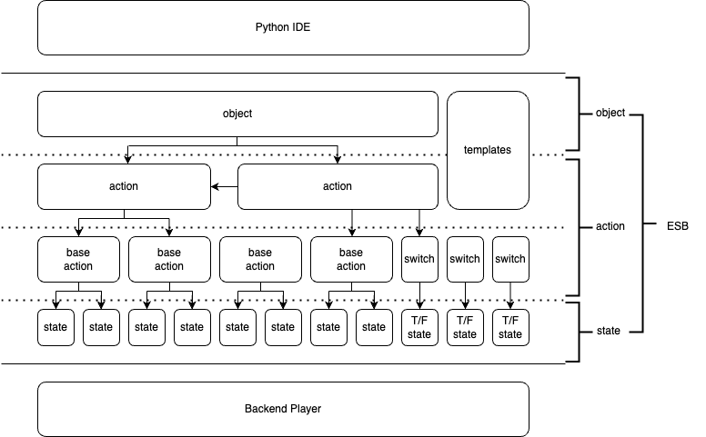

# Full Specification of ElegantSB

***

### Prerequisites


- Basic concepts of storyboarding:
[See Storyboarding Basics](https://www.notion.so/Storyboarding-Basics-7897a9b0112841b09bd5e0b465d22a51)
or [Full Specification of Storyboarding](https://www.notion.so/Full-Specification-4aece3f705d0485495b64564167e76ce)
- (In current Iter) Basic understanding of python. You might need to know how to use `for` loops and function calls to fully exploit the power of ESB.

***

### Basic Concepts



- __States__: If we model a storyboard element as an "object", such as a Text object, we can easily know that an object has its properties, and different types of objects may have different property members. In storyboarding, the objects' properties are subject to time. An object may have different "slices" of properties at different time. We call them "states". States are all that we considered, designed and struggled with when storyboarding.
- __Actions__: Similar with the concept in state machines. Actions are what we actually want to do to an object in a time period. An action results in some state changes. In storyboarding, property value at a certain time can be calculated by easing. Similarly, here action can be simply regarded as two states: state at `start_time` and state at `end_time`.
- __Lifecycle__: For "easy" understanding and modeling the nature of an object, in ESB we imagine an object as a creature. After being created, it is an egg, inactive and need to be hatched. Hatching is like initialization. _P.S. It is necessary for line objects to have some properties initialized before `state` (JSON list)._ After being hatched, the creature is active now and can perform other base actions: Move, Rotate, Scale, Morph, Mutate, Imitate and Destroy and more complicated actions based on these. I will explain them later. Once we destroy this object, this creature is no longer active. This is the same in `destroy()` in storyboarding.
- __Base Actions__: Base action is the first-layer abstraction of action. Considering the classification of properties and the frequency, base actions fall into 3 categories: Position-based action(`move()` and `rotate()`), Size-based action(`scale()`) and Morphology-based action(`morph()`). Position-based action changes the position of an object, size-based action changes the size of an object, while morphology-based action changes other properties that may affect an object's morphology, such as opacity. Besides, we allow a special action, `mutate()`, that changes some properties in a sudden like a pulse. Mutation is not a base action because it consists two actions of a short time period. However, we still keep it in the interface for it is kind of 'basic'. The last one is `imitate()`. A creature may imitate the behavior of another one. To do this in storyboarding, besides hard copying the states, we can use parent id to assign parent-child relationship with two objects. While in ESB, this is achieved by copying the actions. Be careful that after this deep copying, the object no longer imitates anymore. This feature is useful in some cases where we want to have some properties between "parent" and "child" different. For example, we need to rotate two images at the same time, but we do not want them overlap with each other. In order to achieve this, after imitation, we can either move the "parent" or the "child", the two objects will not "stick" with the other anymore. 

***

### Advantage of actions

- One action for two states: In many cases, we need to keep states unchanged for a period. A state-based method requires an additional state that copy the previous state to achieve this, while the action-based method automatically retains the previous state.
- Easy for detecting semantic errors: State-based storyboarding suffers from unexpected behaviors that the debugger cannot detect(unrelated with grammar errors). We call them semantic errors. Semantic errors mainly stem from the overlapping time periods of changing on the same property. In ESB, we use a data structure called `ActionPipe` to enforce that time periods of actions on same property cannot overlap with each other.
- Support loops and pipeline programming paradigm

***

### Usage

1. __chart analyzer as a timing toolkit__

    Before creating a storyboard object, we shall know how to use a chart analyzer first. Chart analyzer reads a C2 JSON format chart and analyzes its base components, such as pages, notes, tempos, etc. This is important for us to locate the objects. To use a chart analyzer, import it first, then create an analyzer object:
    ```commandline
   from util.chart.analyzer import ChartAnalyzer
   analyzer = ChartAnalyzer("path/to/my_chart.json")
    ```
   _some functions that may be helpful:_

    - **get_time(query, by)**: Get the absolute time by query. The query type "by" can be "note_id", "page_id" and "tick". For example, if we want to get the absolute time of the 17th note(counting from 0), we can:
   ```commandline
   t = analyzer.get_time(17, by="note_id")
    ```
   - **get_note_times()**: Get the list of absolute time of all notes. This is useful because it is the replacement of timestamp "start:<note_id>:offset" in storyboarding:
   ```commandline
   t_list = analyzer.get_note_times()
   t = t_list[17] + 0.05                 # t is similar with "start:17:0.05"
    ```
   - **get_page_times()**: Get the list of absolute time of all pages. This is used in case note_id is changing due to frequent modifications on original charts, using page_id instead of note_id can lower the coupling of timing on note ids:
   ```commandline
   t_list = analyzer.get_page_times()
   t = t_list[17] + 0.05                 # now t means 0.05 seconds after the start time of the 17th page(counting from 0)
    ```
   - **get_page_id_by_time(abs_time)** and **get_bounding_ticks_by_time(abs_time)**: Figure out the page id and bounding ticks from absolute time. We can easily see the absolute time from player, but with page id and the start/end tick of that page unclear. These two functions help us find out that info:
   ```commandline
   page_id = analyzer.get_page_id_by_time(100)                      # get the page id at 100 seconds
   start_tick, end_tick = analyzer.get_bounding_tick_by_time(100)   # get the bounding ticks at 100 seconds
    ```
   
   _other functions that may be helpful:_

   - get_page_num(): total number of pages
   - get_tempo_num(): total number of tempos
   - get_note_num(): total number of notes
   - get_events_num(): total number of events
   - get_max_tick(): maximum tick of the chart
   - get_max_time(): maximum absolute time of the chart


2. __storyboard as an object__
   
   Now we can create a storyboard. In ESB, all storyboard components and storyboard itself are python objects. A storyboard object is simple, first we import the module and create a storyboard:
   ```commandline
   from util.storyboard.Storyboard import StoryBoard
   my_storyboard = StoryBoard()
    ```
   The storyboard object only has two functions: `add()` and `parse()`, with no parameters needed. So easy, isn't it? For example, we have a text object named "my_text", and a line object "my_line", we only have to add them to my_storyboard then parse the storyboard, then we will get the JSON string we want:
   ```commandline
   my_storyboard.add(my_text)
   my_storyboard.add(my_line)
   print(my_storyboard.parse())
    ```
   So how to create a text or line object? We will discuss it later. Now if we have a list of objects, say 100 lines, call it my_lines, we can add them to my_storyboard in a for loop:
   ```commandline
   for i in range(my_lines):
       my_storyboard.add(my_lines[i])
   print(my_storyboard.parse())
    ```

3. __scene object as an object__

   Similar with storyboarding, ESB has scene objects, (scene)controller objects and note controller objects. Though many of the methods having been implemented, scene object in ESB should better serve as an interface rather than using it directly. Sprite, Text, and Video are subclasses of scene object, while Line object in ESB does not inherit from scene object because of lacking of base actions.

   First we take a look at what a scene object contains and how it works.